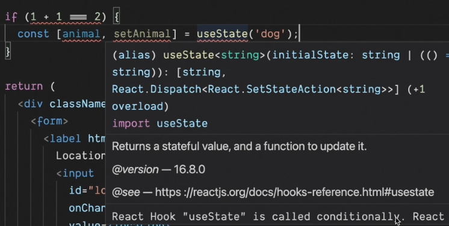
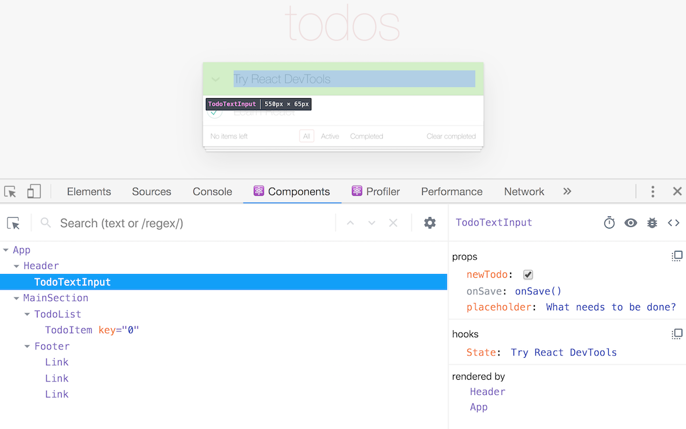
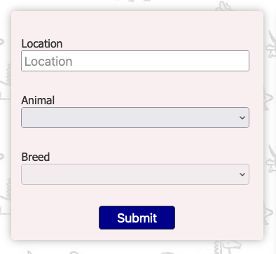

# React course

[https://btholt.github.io/complete-intro-to-react-v6](https://btholt.github.io/complete-intro-to-react-v6)

[https://github.com/btholt/citr-v6-project](https://github.com/btholt/citr-v6-project)

# Components without JSX

Example:

```jsx
const Pet = (props) => {
  return React.createElement("div", {}, [
    React.createElement("h2", {}, props.name),
    React.createElement("h3", {}, props.animal),
    React.createElement("h3", {}, props.breed),
  ]);
};

const App = () => {
  return React.createElement(
    "div",
    {},
    React.createElement("h1", { id: "my-brand" }, "Adopt Me!"),
    React.createElement(Pet, {
      name: "Luna",
      animal: "Dog",
      breed: "Havanese",
    }),
    React.createElement(Pet, {
      name: "Pepper",
      animal: "Bird",
      breed: "Cockatiel",
    }),
    React.createElement(Pet, {
      name: "Sudo",
      animal: "Dog",
      breed: "Wheaten Terrier",
    })
  );
};
ReactDOM.render(React.createElement(App), document.getElementById("root"));
```

<aside>
💡 Data flows from up to down, you can go from parent to child but not from child to parent

</aside>

<aside>
💡 People doesn’t write components like this, they use JSX, this is for learning purposes

</aside>

# Tools

## npm

```bash
npm init
```

<aside>
💡 Set ups manifest for the project

</aside>

## prettier

It’s an automatic code formatter for Javascript

```bash
npm install -D prettier
```

Create a file in the root of your project called .prettierrc with this content

```jsx
{
} //this means no custom configurations applied
```

Edit package.json to run prettier for js and jsx files

```jsx
"scripts": {
    "format": "prettier --write \"src/**/*.{js,jsx}\""
  },
```

Run script

```bash
npm run format
```

## ESLint

Is to force an specific code style

```bash
npm install -D eslint@7.18.0 eslint-config-prettier@8.1.0
```

Add .eslintrc.json in the root of your project with this content:

```json
{
  "extends": ["eslint:recommended", "prettier"],
  "plugins": [],
  "parserOptions": {
    "ecmaVersion": 2021,
    "sourceType": "module",
    "ecmaFeatures": {
      "jsx": true
    }
  },
  "env": {
    "es6": true,
    "browser": true,
    "node": true
  }
}
```

And add the script to package.json

```json
{
  "name": "adopt-me",
  "version": "1.0.0",
  "description": "Just for fun",
  "main": "index.js",
  "scripts": {
    "format": "prettier --write \"src/**/*.{js,jsx}\"",
    "lint": "eslint \"src/**/*.{js,jsx}\" --quiet"
  },
  "author": "",
  "license": "ISC",
  "devDependencies": {
    "eslint": "^7.18.0",
    "eslint-config-prettier": "^8.1.0",
    "prettier": "^2.5.1"
  }
}
```

And finally, run it

```bash
npm run lint
```

```bash
> adopt-me@1.0.0 lint
> eslint "src/**/*.{js,jsx}" --quiet

/Users/sergio.rodriguezp/vscode/adopt-me/src/app.js
   2:10  error  'React' is not defined     no-undef
   3:5   error  'React' is not defined     no-undef
   4:5   error  'React' is not defined     no-undef
   5:5   error  'React' is not defined     no-undef
  10:10  error  'React' is not defined     no-undef
  13:5   error  'React' is not defined     no-undef
  14:5   error  'React' is not defined     no-undef
  19:5   error  'React' is not defined     no-undef
  24:5   error  'React' is not defined     no-undef
  31:1   error  'ReactDOM' is not defined  no-undef
  31:17  error  'React' is not defined     no-undef

✖ 11 problems (11 errors, 0 warnings)
```

## GIT

Initialize repo:

```bash
git init
```

Add .gitignore

```bash
node_modules/
.cache/
dist/
.env
.DS_STORE
coverage/
.vscode/
```

## Parcel

It’s a bundleller for Javascript, like Webpack. It’s a zero configuration tool

```bash
npm install -D parcel@1.12.3
```

Remove these script tags from index.html because w are going to install React in our application

```html
<script src="https://unpkg.com/react@17.0.1/umd/react.development.js"></script>
<script src="https://unpkg.com/react-dom@17.0.1/umd/react-dom.development.js"></script>
```

Install React via npm

```bash
npm install react@17.0.1 react-dom@17.0.1
```

Now we can import React and ESlint won’t complain anymore about `React is not defined`

```jsx
import React from "react";
import ReactDOM from "react-dom";
```

And run Parcel

```bash
npm run dev
```

```bash
> adopt-me@1.0.0 dev
> parcel src/index.html

Server running at http://localhost:1234
✨  Built in 4.14s.
```

<aside>
💡 This will start a web server in port 1234. Any changes done in the code will automatically refresh the page

</aside>

Move Pet component to its own file, as it’s kind of standard practice:

```jsx
import React from "react";

const Pet = (props) => {
  return React.createElement("div", {}, [
    React.createElement("h2", {}, props.name),
    React.createElement("h3", {}, props.animal),
    React.createElement("h3", {}, props.breed),
  ]);
};

export default Pet;
```

```jsx
import React from "react";
import ReactDOM from "react-dom";
import Pet from "./Pet";
```

<aside>
💡 If we don’t add the ‘./’ it will try to find Pet into the application dependencies

</aside>

## Babel

It’a a transpiler tool (e.g. from JSX to Javascript).

Create a `.babelrc` file:

```jsx
{
    "presets": [
        [
            "@babel/preset-react",
            {
                "runtime": "automatic"
            }
        ]
    ]
}
```

Install babel

```bash
npm install -D @babel/core@7.12.16 @babel/preset-react@7.12.13
```

Add browserslist in package.json. This means what browsers and versions we want to apply Parcel and Babel

```jsx
"browserslist": [
    "last 2 Chrome versions"
  ]
```

<aside>
💡 This is just an example, in production you may want to target a wide number of browsers

</aside>

More info: [https://browserlist.dev](https://browserslist.dev/?q=bGFzdCAyIHZlcnNpb25z)

# JSX

## Refactor component

Pet component refactored:

```jsx
const Pet = (props) => {
  return (
    <div>
      <h2>{props.name}</h2>
      <h3>{props.animal}</h3>
      <h3>{props.breed}</h3>
    </div>
  );
};

export default Pet;
```

```jsx
import ReactDOM from "react-dom";
import Pet from "./Pet";

const App = () => {
  return (
    <div>
      <h1>Adopt Me!</h1>
      <Pet name="Luna" animal="Dog" breed="Havanese" />
      <Pet name="Pepper" animal="Bird" breed="Cockatiel" />
      <Pet name="Beam" animal="Dog" breed="Wheaten Terrier" />
    </div>
  );
};

ReactDOM.render(React.createElement(App), document.getElementById("root"));
```

<aside>
💡 As you noticed ESLint is complaining about imports, we need to add an aditional tool to understand React

</aside>

<aside>
💡 With the latest version of React we don’t need to import React anymore, Babel is going to do it in the transpilation stage

</aside>

## Fixing ESLint

```bash
npm install -D eslint-plugin-import@2.22.1 eslint-plugin-jsx-a11y@6.4.1 eslint-plugin-react
@7.22.0
```

<aside>
💡 jsx-a11y is for accessibility hints in JSX

</aside>

Enable plugins in .eslintrc.json and disable some rules:

```jsx
{
    "extends": [
        "eslint:recommended",
        "prettier",
        "plugin:import/errors",
        "plugin:react/recommended",
        "plugin:jsx-a11y/recommended"
    ],
    "rules": {
        "react/prop-types": 0,
        "react/react-in-jsx-scope": 0
    },
    "plugins": ["react", "import", "jsx-a11y"],
    "parserOptions": {
        "ecmaVersion": 2021,
        "sourceType": "module",
        "ecmaFeatures": {
            "jsx": true
        }
    },
    "env": {
        "es6": true,
        "browser": true,
        "node": true
    },
    "settings": {
        "react": {
            "version": "detect"
        }
    }
}
```

More info about skipped rules:

- [prop-types](https://github.com/yannickcr/eslint-plugin-react/blob/master/docs/rules/prop-types.md)
- [react-in-jsx-scope](https://github.com/yannickcr/eslint-plugin-react/blob/master/docs/rules/react-in-jsx-scope.md)

Edit app.js

```jsx
ReactDOM.render(<App />, document.getElementById("root"));
```

# Hooks

## useState

It’s for managing state inside your React application.

Example:

```jsx
const SearchParams = () => {
  const location = "Seattle, WA";
  return (
    <div className="search-params">
      <form>
        <label htmlFor="location">
          location
          <input
            id="location"
            value={location.toUpperCase}
            placeholder="Location"
          />
        </label>
        <button>Submit</button>
      </form>
    </div>
  );
};

export default SearchParams;
```

```jsx
import ReactDOM from "react-dom";
import SearchParams from "./SearchParams";

const App = () => {
  return (
    <div>
      <h1>Adopt Me!</h1>
      <SearchParams />
    </div>
  );
};

ReactDOM.render(<App />, document.getElementById("root"));
```

When we test it is going to display this error:

```jsx
Warning: You provided a `value` prop to a form field without an `onChange` handler. This will render a read-only field. If the field should be mutable use `defaultValue`. Otherwise, set either `onChange` or `readOnly`.
```

<aside>
💡 You have to keep in mind how React works, everytime React detects a change anywhere, it rerurns its render cycle

</aside>

<aside>
💡 We need a mechanism to update the state of the input

</aside>

Fixed using useState hook

```jsx
import { useState } from "react";

const SearchParams = () => {
  const [location, setLocation] = useState("Seattle, WA");
  return (
    <div className="search-params">
      <form>
        <label htmlFor="location">
          location
          <input
            id="location"
            onChange={(e) => setLocation(e.target.value)}
            value={location.toUpperCase()}
            placeholder="Location"
          />
        </label>
        <button>Submit</button>
      </form>
    </div>
  );
};

export default SearchParams;
```

## Rules of hooks

### Ordering

Because of React’s render cycle, hooks must be called in a particular order (no matter what, but always the same)

So don’t do things like this:

```jsx
const [location, setLocation] = useState("Seattle, WA");
if (someCondition) {
  const [breed, setBreed] = useState("American Stanford");
}
```

Because it could mess location with breed when re-rendering. We can add an ESLint rule to avoid this

<aside>
💡 Take not that React just re-render the component that has been changed, that’s why you get so much performance out of it.

</aside>

## ESLint & hooks

Install

```bash
npm install -D eslint-plugin-react-hooks@4.2.
```

Add rules for hooks:

```json
{
  "extends": [
    "eslint:recommended",
    "plugin:import/errors",
    "plugin:react/recommended",
    "plugin:jsx-a11y/recommended",
    "plugin:react-hooks/recommended",
    "prettier"
  ]
}
```

<aside>
💡 Note that prettier must be after any other plugin

</aside>

Example of ESLint warning of a hook being called conditionally:



## Animal & Breed Selector Hooks

```jsx
import { useState } from "react";

const ANIMALS = ["bird", "cat", "dog", "rabbit", "reptile"];

const SearchParams = () => {
  const [location, setLocation] = useState("Seattle, WA");
  const [animal, setAnimal] = useState("");
  const [breed, setBreed] = useState("");
  const breeds = [];

  return (
    <div className="search-params">
      <form>
        <label htmlFor="location">
          location
          <input
            id="location"
            onChange={(e) => setLocation(e.target.value)}
            value={location.toUpperCase()}
            placeholder="Location"
          />
        </label>
        <label htmlFor="animal">
          animal
          <select
            id="animal"
            value={animal}
            onChange={(e) => setAnimal(e.target.value)}
            onBlur={(e) => setAnimal(e.target.value)}
          >
            <option />
            {ANIMALS.map((animal) => (
              <option value={animal} key={animal}>
                {animal}
              </option>
            ))}
          </select>
        </label>
        <label htmlFor="breed">
          breed
          <select
            id="breed"
            value={breed}
            onChange={(e) => setBreed(e.target.value)}
            onBlur={(e) => setBreed(e.target.value)}
          >
            <option />
            {breeds.map((breed) => (
              <option value={breed} key={breed}>
                {breed}
              </option>
            ))}
          </select>
        </label>
        <button>Submit</button>
      </form>
    </div>
  );
};

export default SearchParams;
```

## useEffect & fetching API data

```jsx
import { useState, useEffect } from "react"
import Pet from './Pet'

const SearchParams = () => {
    const breeds = []

    useEffect(() => {
        requestPets()
    }, [])

    async function requestPets() {
        const res = await fetch(
            `http://pets-v2.dev-apis.com/pets?animal=${animal}&location=${location}&breed=${breed}`
        )

        const json = await res.json()

        console.log(json.pets)
    }
```

<aside>
💡 Take a look at [async/await functions](https://javascript.info/async-await) and [fetch](https://javascript.info/fetch)

</aside>

<aside>
💡 If we don’t add a second argument to `useEffect()`, it will call the API on every render. An empty array means the API will be called just once

</aside>

Now we will render the API results:

```jsx
</form>
    {
        pets.map(pet => (
            <Pet
                name={pet.name}
                animal={pet.animal}
                breed={pet.breed}
                key={pet.id}
            />
        ))
    }
```

## Custom hooks

Useful when we want to replicate over and over again and not stick it to just one component

Create hook:

```jsx
import { useState, useEffect } from "react";

const localCache = {};

export default function useBreedList(animal) {
  const [breedList, setBreedList] = useState([]);
  const [status, setStatus] = useState("unloaded");

  useEffect(() => {
    if (!animal) {
      setBreedList([]);
    } else if (localCache[animal]) {
      setBreedList(localCache[animal]);
    } else {
      requestBreedList();
    }
    async function requestBreedList() {
      setBreedList([]); //empty list while loading API data to avoid weird things
      setStatus("loading");

      const res = await fetch(
        `http://pets-v2.dev-apis.com/breeds?animal=${animal}`
      );

      const json = await res.json();
      localCache[animal] = json.breeds || [];
      setBreedList[localCache[animal]];
      setStatus("loaded");
    }
  }, [animal]);

  return [breedList, status];
}
```

# Handling user input

Make the form can be submitted to load pets whether we click the button or hit enter

```jsx
// inside render
const [pets, setPets] = useState([]);

// replace <form>
<form
  onSubmit={e => {
    e.preventDefault();
    requestPets();
  }}
>
```

List of user interaction events: [React docs](https://reactjs.org/docs/events.html#supported-events)

# Component composition

A possible way two split the component would be to have a filters component and a results component.

```jsx
import Pet from "./Pet";

const Results = ({ pets }) => {
  return (
    <div className="search">
      {!pets.length ? (
        <h1>No Pets Found</h1>
      ) : (
        pets.map((pet) => {
          return (
            <Pet
              animal={pet.animal}
              key={pet.id}
              name={pet.name}
              breed={pet.breed}
              images={pet.images}
              location={`${pet.city}, ${pet.state}`}
              id={pet.id}
            />
          );
        })
      )}
    </div>
  );
};

export default Results;
```

<aside>
💡 Notice that the props object has been destructured so we can reference `pets` easier, so instead of having `Results = (props)` we have `Results = ({ pets })`

</aside>

```jsx
	</form>
      <Results pets={pets} />
    </div>
  );
};

export default SearchParams;
```

# Development tools

## Environment

```jsx
NODE_ENV = development;
```

Parcel set this to development automatically, buy other libraries less opinionated don’t

<aside>
💡 It’s important to set `NODE_ENV=production` when shipping stuff as the performance of development env is much slower

</aside>

## Strict mode

Basically it doesn’t allow to use depreacted stuff

Activate it:

```jsx
import  { StrictMode } from "react";

(...)

ReactDOM.render(<StrictMode><App /></StrictMode>, document.getElementById("root"));
```

## React dev tools

It has a components explorer and a profiler

[https://addons.mozilla.org/es/firefox/addon/react-devtools/](https://addons.mozilla.org/es/firefox/addon/react-devtools/)



# React Router

Installation

```jsx
npm install react-router-dom@5.2.0
```

Create dummy component to route conditionally

```jsx
const Details = () => {
  return <h2>hi lololol omg wtf!</h2>;
};

export default Details;
```

Import Details and React router and use it

```jsx
import { StrictMode } from "react";
import ReactDOM from "react-dom";
import { BrowserRouter as Router, Route } from "react-router-dom";
import SearchParams from "./SearchParams";
import Details from "./Details";

const App = () => {
  return (
    <div>
      <h1>Adopt Me!</h1>
      <Router>
        <Route path="/details/:id">
          <Details />
        </Route>
        <Route path="/">
          <SearchParams />
        </Route>
      </Router>
    </div>
  );
};

ReactDOM.render(
  <StrictMode>
    <App />
  </StrictMode>,
  document.getElementById("root")
);
```

<aside>
💡 React router does partial matches. The URL `/teachers/jem/young` will match the paths `/`, `/teachers` , `/teachers/jem`, and `/teachers/jem/young`

</aside>

## Switch

It is used to avoid Router to route more than one path

```jsx
import { StrictMode } from "react";
import ReactDOM from "react-dom";
import { BrowserRouter as Router, Route, Switch } from "react-router-dom";
import SearchParams from "./SearchParams";
import Details from "./Details";

const App = () => {
  return (
    <div>
      <h1>Adopt Me!</h1>
      <Router>
        <Switch>
          <Route path="/details/:id">
            <Details />
          </Route>
          <Route path="/">
            <SearchParams />
          </Route>
        </Switch>
      </Router>
    </div>
  );
};

ReactDOM.render(
  <StrictMode>
    <App />
  </StrictMode>,
  document.getElementById("root")
);
```

## Link

It allows us to navigate to other pages without reloading the whole page

```jsx
import  { Link } from 'react-router-dom';
(...)
  return (
    <Link to={`/details/${id}`} className="pet">
      (...)
    </Link>
  );
};
```

# Class components

Instead of having a function that represents a component we can have a class that represents a component. Class component has lifecycle methods and they work like function components in many ways, but there are slight variations. This is the original way to writing React components, before hooks came in.

Important methods:

- `render()` : Returns the markup of the component
- `constructor()`: Sets the initial state of the component
- `componentDidMount()`: It’s called when the component is rendered for the first time
- `setState()`: Modifies the state of the component. It’s not necessary to pass all the parameters of the object, it will merge with the previous content
- More: [https://es.reactjs.org/docs/react-component.html](https://es.reactjs.org/docs/react-component.html)

```jsx
import { Component } from "react";
import { withRouter } from "react-router-dom";

class Details extends Component {
  constructor() {
    super();

    this.state = { loading: true };
  }

  async componentDidMount() {
    const res = await fetch(
      `http://pets-v2.dev-apis.com/pets?id=${this.props.match.params.id}`
    );
    const json = await res.json();
    this.setState(
      Object.assign(
        {
          loading: false,
        },
        json.pets[0]
      )
    );
  }

  render() {
    const { animal, breed, city, state, description, name } = this.state;
    return (
      <div className="details">
        <div>
          <h1>{name}</h1>
          <h2>
            {animal} - {breed} - {city}, {state}
          </h2>
          <button>Adopt {name}</button>
          <p>{description}</p>
        </div>
      </div>
    );
  }
}

export default withRouter(Details);
```

<aside>
💡 Object.assign will merge `{loading: false}` and `json.pets[0]` into a new object

</aside>

<aside>
💡 In order to Details component to have all the routing information we have to export it as this: `export default withRouter(Details)`

</aside>

# Class properties

Instead of having:

```jsx
class Details extends Component {
    constructor () {
        super();

        this.state = { loading: true};
    }
```

We are going to refactor it for clarity to:

```jsx
class Details extends Component {
    state = {loading: true};
```

But this syntax is not going to be supported in all browsers so we need Babel to transpile it:

1. Install

```bash
npm i -D @babel/plugin-proposal-class-properties@7.13.0 @babel/preset-env@7.13.5 @babel/eslint-parser@7.13.4
```

1. Configure

```json
{
    "presets": [
			  (...)
        "@babel/preset-env"
    ],
    "plugins": [
        "@babel/plugin-proposal-class-properties"
    ]
}
```

```json
{
		(...)
    "parser": "@babel/eslint-parser",
    (...)
}
```

# Managing state in class component

To show it we’re going to implement a carousel for the pets’ images

```jsx
import { Component } from "react";

class Carousel extends Component {
  state = { active: 0 };

  static defaultProps = {
    images: ["http://pets-images.dev-apis.com/pets/none.jpg"],
  };

  render() {
    const { active } = this.state;
    const { images } = this.props;

    return (
      <div className="carousel">
        
        <div className="carousel-smaller">
          {images.map((photo, index) => (
            
          ))}
        </div>
      </div>
    );
  }
}

export default Carousel;
```

```jsx
(...)
import Carousel from './Carousel';
(...)
class Details extends Component {
    (...)
    render () {
				(...)
        const {animal, breed, city, state, description, name, images } = this.state
        return (
            <div className="details">
                <Carousel images={images} />
	(...)
```

<aside>
💡 state vs props: state is mutable but props isn’t

</aside>

# Interactive class component

```jsx
class Carousel extends Component {

    handleIndexClick(event) {
        this.setState({
            active: +event.target.dataset.index
        })
    }

    render() {
        (...)
        return (
            <div className="carousel">
                <div className="carousel-smaller">
                    {images.map((photo, index) => (
                        // eslint-disable-next-line
                        
(...)
```

<aside>
💡 + before event.target.dataset.index casts the string to int

</aside>

The above will throw this error:

```jsx
**Uncaught TypeError: this is undefined**
```

Because the function lacks context to be executed. To fix it we can convert it to an arrow function:

```jsx
handleIndexClick = (event) => {
  this.setState({
    active: +event.target.dataset.index,
  });
};
```

# Component error handling

## Error boundaries

These feature allows to catch errors in components and handle them in a proper way. It can only be used with class components

```jsx
import { Component } from "react";
import { Link } from "react-router-dom";

class ErrorBoundary extends Component {
  state = { hasError: false };
  static getDerivedStateFromError() {
    return { hasError: true };
  }
  componentDidCatch(error, info) {
    // I log this to Sentry, Azure Monitor, New Relic, TrackJS....
    console.error("ErrorBoundary caught an error", error, info);
  }

  render() {
    if (this.state.hasError) {
      return (
        <h2>
          This listing has an error. <Link to="/">Click here</Link> to go back
          to the home page.
        </h2>
      );
    }
    return this.props.children;
  }
}

export default ErrorBoundary;
```

<aside>
💡 If we don’t have an error we will return this.props.children, as the component doesn’t have any default content it won’t render anything.

</aside>

```jsx
import ErrorBoundary from './ErrorBoundary';
(...)
const DetailsWithRouter = withRouter(Details);

export default function DetailsWithErrorBoundary() {
    return (
        <ErrorBoundary>
            <DetailsWithRouter />
        </ErrorBoundary>
    )
}
```

<aside>
💡 We have to wrap our visual component inside ErrorBoundary because otherwise it won’t be able to catch any error

</aside>

## Redirect on error

```jsx
(...)
componentDidCatch(error, info) {
    console.error("ErrorBoundary caught an error", error, info);
    setTimeout(() => this.setState({ redirect: true }), 5000);
  }
(...)
render() {
    if (this.state.redirect) {
      return <Redirect to="/" />;
    } else if (this.state.hasError) {
      (...)
(...)
```

# Context

Used for global state. Use with caution. Let’s do an example for setting a dark mode theme.

```jsx
import { createContext } from "react";

const ThemeContext = createContext();

export default ThemeContext;
```

```jsx
import ThemeContext from './ThemeContext';

const App = () => {
  const theme = useState("darkblue");

  return (
    <ThemeContext.Provider value={theme}>
    (...)
    </ThemeContext.Provider>
(...)
```

Modify context from some component

```jsx
import { useEffect, useState, useContext } from "react";
import ThemeContext from "./ThemeContext";

const SearchParams = () => {
(...)
const [theme] = useContext(ThemeContext);

return (
<div className="search-params">
      <form
        onSubmit={(e) => {
          e.preventDefault();
          requestPets();
        }}
      >
        (...)
        <button style={{backgroundColor: theme}}>Submit</button>
      </form>
      (...)
    (...)
```

And this is the result:



# Implement modals

```jsx
import { useEffect, useRef } from "react";
import { createPortal } from "react-dom";

const modalRoot = document.getElementById("modal");

const Modal = ({ children }) => {
  const elRef = useRef(null);
  if (!elRef.current) {
    elRef.current = document.createELement("div");
  }
  useEffect(() => {
    modalRoot.appendChild(elRef.current);
    return () => modalRoot.removeChild(elRef.children);
  }, []);

  return createPortal(<div>{children}</div>);
};

export default Modal;
```

<aside>
💡 We will create just one div, as it was a Singleton

</aside>

<aside>
💡 We have to clean up the dom when we’re done, otherwise we could be adding a div to the DOM every time we open a modal

</aside>

Documentation:

[https://es.reactjs.org/docs/hooks-reference.html#useref](https://es.reactjs.org/docs/hooks-reference.html#useref)

[https://es.reactjs.org/docs/portals.html](https://es.reactjs.org/docs/portals.html)
